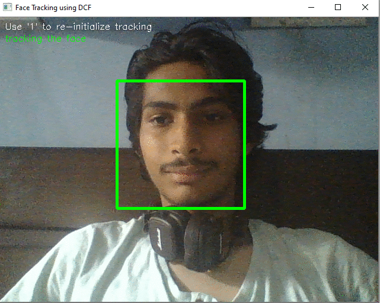
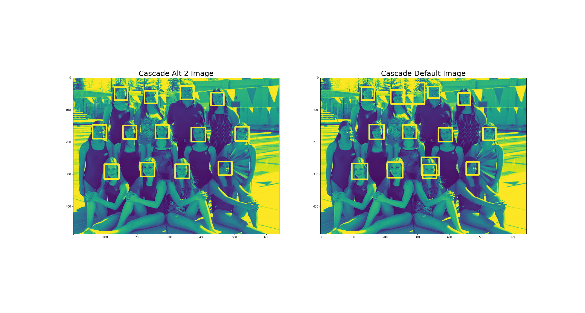

# face-tracking-recognition-notebook

### Description
This repository contains a notebook with implementation of many OpenCV algorithms in Python. 

### Computer Vision Alogorithms used 
* Real Time Face Detection 
* Cascade Image Detection 
* Cascade Alt 2 Detection 
* Haar Cascade Classifier (Mulitple Face Detection)
* Lower Body Cascade Classifier (Lower Body)
* Caffe DNN face detection 
* Tensorflow DNN face detection 
* Frontal Face Detector (DLib Face Detector) 

### Algos in Action 
* Real Time Face Detection 

* Cascade & Alt 2 Detection  

* Haar Cascade Classifier (Mulitple Face Detection)

* Lower Body Cascade Classifier (Lower Body)

* Caffe DNN face detection 

* Tensorflow DNN face detection 

### Sources 
1) OpenCV Computer Vision with Python
